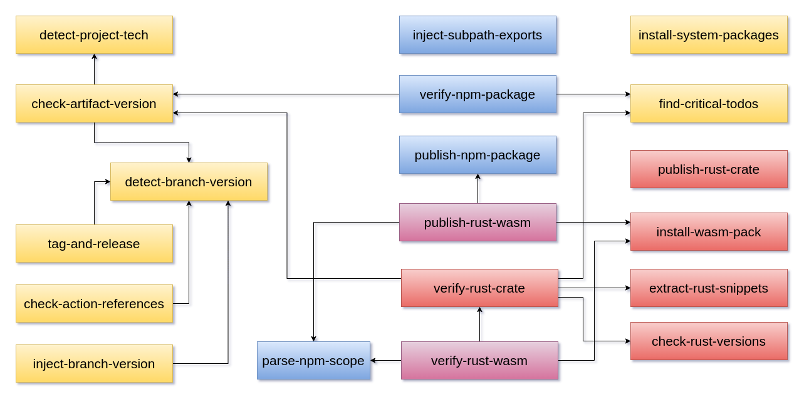

# aurora-github

_Elegant workflows for GitHub Actions_

**aurora-github** is a gallery of GitHub actions designed to create elegant and minimalist _pipelines_ for a variety of technologies - focusing on [GitHub flow](https://docs.github.com/en/get-started/using-github/github-flow) best practices such as _default branch protection_, _pull requests_ and _convention-over-configuration_.

In particular, the actions can be grouped by technology:

## 🦀Rust crate

- [verify-rust-crate](actions/verify-rust-crate/README.md)

- [publish-rust-crate](actions/publish-rust-crate/README.md)

## 📦NodeJS package

- [verify-npm-package](actions/verify-npm-package/README.md)

- [publish-npm-package](actions/publish-npm-package/README.md)

- [inject-subpath-exports](actions/inject-subpath-exports/README.md)

- [check-subpath-exports](actions/check-subpath-exports/README.md)

## 🦀Rust 🌐WebAssembly

- [verify-rust-wasm](actions/verify-rust-wasm/README.md)

- [publish-rust-wasm](actions/publish-rust-wasm/README.md)

## 😺GitHub Actions

- [check-action-references](actions/check-action-references/README.md)

- [publish-github-pages](actions/publish-github-pages/README.md)

- [detect-project-tech](actions/detect-project-tech/README.md)

- [run-custom-tests](run-custom-tests/README.md)

## 🏷️Semantic versioning

- [detect-branch-version](actions/detect-branch-version/README.md)

- [enforce-branch-version](actions/enforce-branch-version/README.md)

- [tag-and-release](actions/tag-and-release/README.md)

## 🦀Rust utilities

- [check-rust-versions](actions/check-rust-versions/README.md)

- [extract-rust-snippets](actions/extract-rust-snippets/README.md)

- [install-wasm-pack](actions/install-wasm-pack/README.md)

## 📦NodeJS utilities

- [setup-nodejs-context](actions/setup-nodejs-context/README.md)

- [parse-npm-scope](actions/parse-npm-scope/README.md)

## 🧰General-purpose utilities

- [find-critical-todos](actions/find-critical-todos/README.md)

- [install-system-packages](actions/install-system-packages/README.md)

## Further references

- [GitHub actions](https://docs.github.com/en/actions)
