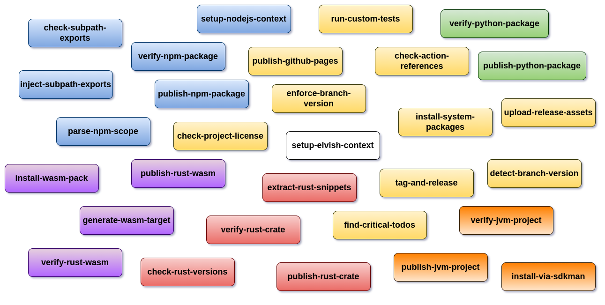

# aurora-github

_Elegant pipelines for GitHub Actions_

**aurora-github** is a gallery of GitHub actions designed to create elegant and minimalist _pipelines_ for a variety of technologies - focusing on [GitHub flow](https://docs.github.com/en/get-started/using-github/github-flow) best practices such as _default branch protection_, _pull requests_ and _convention-over-configuration_.

In particular, the actions can be grouped by technology:

## 🦀Rust crate

- [verify-rust-crate](./actions/verify-rust-crate/README.md)

- [publish-rust-crate](./actions/publish-rust-crate/README.md)

## 📦NodeJS package

- [verify-npm-package](./actions/verify-npm-package/README.md)

- [publish-npm-package](./actions/publish-npm-package/README.md)

## 🦀Rust 🌐WebAssembly

- [verify-rust-wasm](./actions/verify-rust-wasm/README.md)

- [publish-rust-wasm](./actions/publish-rust-wasm/README.md)

## 😺GitHub Actions library

- [check-action-references](./actions/check-action-references/README.md)

## 🏷️Semantic versioning

- [detect-branch-version](./actions/detect-branch-version/README.md)

- [inject-branch-version](./actions/inject-branch-version/README.md)

- [check-artifact-version](./actions/check-artifact-version/README.md)

- [tag-and-release](./actions/tag-and-release/README.md)

## 🦀Rust utilities

- [check-rust-versions](./actions/check-rust-versions/README.md)

- [extract-rust-snippets](./actions/extract-rust-snippets/README.md)

- [install-wasm-pack](./actions/install-wasm-pack/README.md)

## 📦NodeJS utilities

- [parse-npm-scope](./actions/parse-npm-scope/README.md)

## 🧰General-purpose utilities

- [find-critical-todos](./actions/find-critical-todos/README.md)

- [detect-project-tech](./actions/detect-project-tech/README.md)

## Further references

- [GitHub actions](https://docs.github.com/en/actions)
